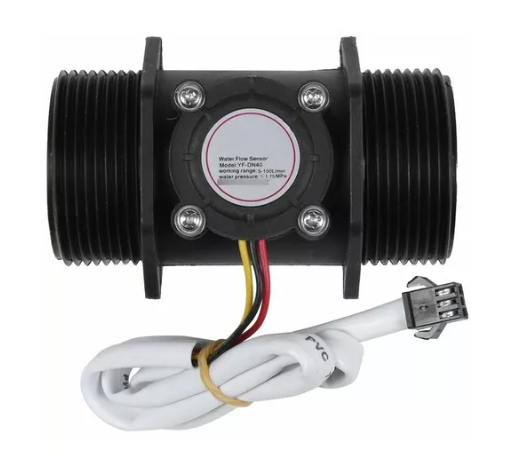
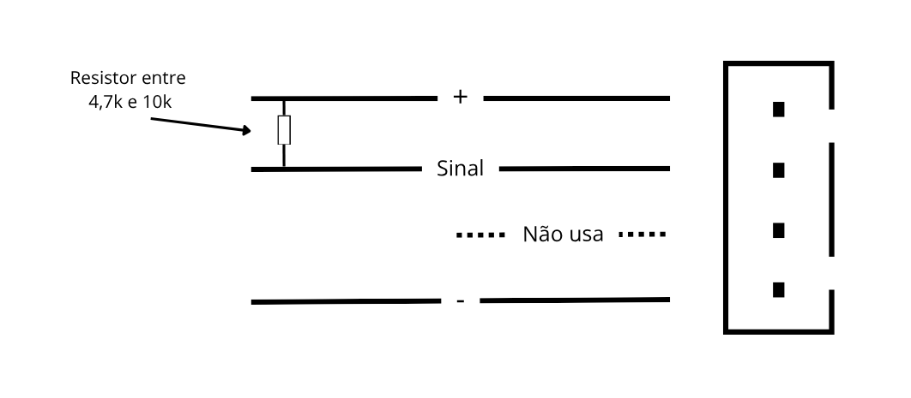
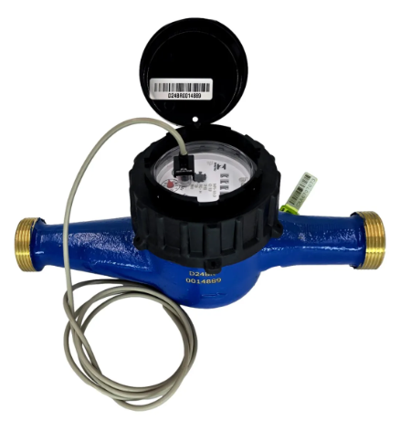
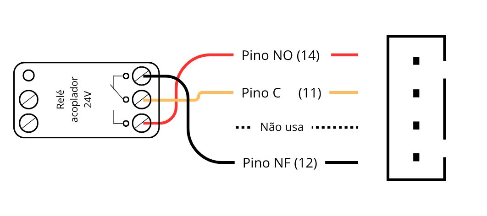
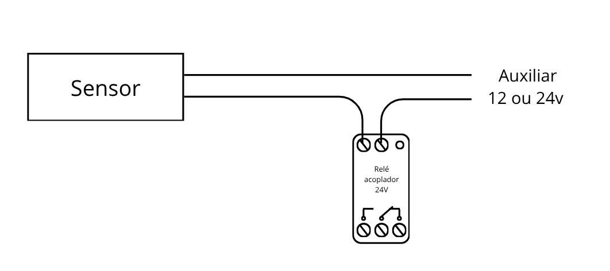
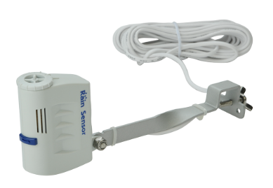

# Guia Interno - Montagem Sensores e Acessórios

_Atualizado em 14/04/2026_

---
<!--
# Sumário

1. [Sensores Plugados ao F16/H1/I6](#sensores-plugados-ao-f16)

   1.1 [Sensor de Vazão para Linha Principal ou de Fertirrigação](#sensor-de-vazão-para-linha-principal-ou-de-fertirrigação)

   1.2 [Sensor de Chuva](#sensor-de-chuva)

   1.3 [Sensor Binário (on/off)](#sensor-binário-onoff)

   1.4 [Sensor de Nível](#sensor-de-nível)

2. [MultiSensores - Sensores Vinculados ao F16](#multisensores---sensores-vinculados-ao-f16)

   2.1 [Sensor Ambiental - T°, UR e DPV](#sensor-ambiental---temperatura-umidade-e-dpv-déficit-de-pressão-de-vapor)

   2.2 [Sensor de Pressão](#sensor-de-pressão)

   2.3 [Sensor de EC de Linha](#sensor-de-ec-de-linha)

   2.4 [Sensor de CO2](#sensor-de-co2)

   2.5 [Sensor de Luz PAR](#sensor-de-luz-par)

   2.6 [Sensor de Radiação Solar](#sensor-de-radiação-solar)

   2.7 [Sensor Umisolo - EC, Umidade e Temperatura do Solo/Substrato](#sensor-umisolo---umidade-ec-e-temperatura-do-solosubstrato)

3. [Demais Acessórios](#demais-acessórios)

   3.1 [Sirene](#sirene)

4. [Dúvidas? Estamos a disposição](#dúvidas-estamos-a-disposição)
-->

# Sensores Plugados ao F16/H1/I6

Estes sensores você conecta diretamente no F16, e não fazem uso de uma placa eletrônica adicional.

## Sensor de Vazão (efeito hall) para Linha Principal ou de Ferti

- Comprimento do cabo: Cabo padrão com 5 metros de comprimento, podendo ser alongado até 15 metros.
- Conector obrigatório de 4 vias, com o 3° pino de cima pra baixo ficando morto.
- Utilizar Resistor pull UP (entre sinal e tensão +) com valor de 4,7k a 10k

Exemplo de sensor:

Esquema do conector:

## Sensor de Vazão (contato seco) para Linha Principal ou de Ferti

- Comprimento do cabo: Cabo padrão com 5 metros de comprimento, podendo ser alongado até 50 metros.
- Conector obrigatório de 4 vias, com o 3° pino de cima pra baixo ficando morto.
- Utilizar Acessório conector (SKU 568 ou 1083)

Exemplo de sensor:

Esquema do conector:

Esquema de ligação do Sensor ao Conector

## Sensor de Chuva

- Comprimento do cabo: Cabo padrão com 5 metros de comprimento, podendo ser alongado até 30 metros.
- Conector preferencial de 4 vias, com o 3° pino de cima pra baixo ficando morto.
- Necessário relé atork para intermediação do comando

Exemplo do sensor:

Esquema do conector:

Esquema de ligação do Sensor ao Conector

<!--
**Atuação:** Bloqueio ou atuação de programações quando detectado a quantidade de chuva ajustada.

**Número máximo permitido:** 1.

**Comprimento do cabo:** Cabo padrão com 5 metros de comprimento, podendo ser alongado até 30 metros.

**Faixa de Regulagem para atuação:** 5 a 20 mm de chuva.

**Frequência de leitura:** Permanece em stand-by até que o estado do sinal seja alterado.

## Instalação

Em area aberta, longe de telhados, árvores ou objetos que possam alterar a precisão de leitura

## Sensor Binário (on/off)

Permite o bloqueio ou atuação de programações, somente quando identificado um sinal externo.

Pode trabalhar de duas formas:
1. Interrompendo a programação: Cancela a atuação da programação em andamento (podendo ser de imediato ou com retardo de até 60 segundos)
2. Permitindo terminar a programação atual: Não cancela a programação em andamento e interrompe a partir da próxima, se o sensor estiver ativo no momento dela.

## Características Principais

**Atuação:** Bloqueio ou atuação de programações, somente quando identificado um sinal externo.

**Número máximo permitido:** 4.

**Comprimento do cabo:** Cabo padrão com 1 metro de comprimento até o relé de intermediação. O comprimento pós relé é feito pelo usuário e tem tamanho ilimitado.

**Faixa de Regulagem para atuação:** Apenas informativo ligado ou desligado

**Frequência de leitura:** Permanece em stand-by até que o estado do sinal seja alterado.

## Instalação

Varia de acordo com o sinal que será fornecido para atuação.

## Sensor de Nível

Permite monitorar o nível, a distância, com medição de volume.

Informa a porcentagem de água/solução que há no reservatório.

## Características Principais

**Atuação:** Monitoramento de nível de reservatório, informando quando estiver abaixo ou acima dos limites configurados.

**Número máximo permitido:** 1.

**Comprimento do cabo:** Cabo padrão com 5 metros de comprimento, não podendo ser prolongado.

**Faixa de Regulagem para atuação:**
- Distância mínima: 15 cm do sensor.
- Distância máxima: 120 cm do sensor.

**Frequência de leitura:** 1 leitura por minuto.

## Instalação

Fixado no centro do reservatório, mirando ao fundo.

# MultiSensores - Sensores Vinculados ao F16

Estes sensores possuem uma placa eletrônica a parte e são vinculados ao F16 via protocolo Wi-Fi

Neste tipo de Sensores, há também um display informativo, com exibição dos dados lidos.

## Sensor Ambiental - Temperatura, Umidade e DPV (Déficit de Pressão de Vapor)

Faz a leitura da Temperatura, Umidade Relativa (UR) e Déficit de Pressão de Vapor (DPV).

**Sensor de Leitura:**

**Display Informativo:**

## Características Principais

**Atuação:** Monitoramento ambiental, bloqueio de execução de programações, acionamento de exaustores e nebulizadores, dentre outros.

**Range de leitura:** 
- Temperatura: -10 a 60 °C
- Umidade: 0 a 100 %
- DPV: 0 a 5 kPa

**Frequência de leitura:** 1 leitura por minuto.

**Número máximo permitido:** Sem limite, desde que se houverem outros MultiSensores, a soma não ultrapasse 16.

**Comprimento do cabo:** Cabo padrão com 15 metros de comprimento, podendo ser alongado até 100 metros.

## Instalação

Sua instalação é no ar, em local abrigado de chuva ou incidência direta de água, como por exemplo, de um sistema de nebulização.

Além do uso vinculado ao F16, o mesmo possui duas saídas que podem ser utilizadas para comandar ações que você programar.

# Sensor de Pressão

Faz a leitura de pressão da linha principal de irrigação.

Disponibiliza a informação no display e nos gráficos online.

**Sensor de Leitura:**

**Display Informativo:**

## Características Principais

**Atuação:** Monitoramento da pressão em linha e cancelamento da irrigação em caso de alta/baixa pressão.

**Range de leitura:** 0 a 17 Bar.

**Frequência de leitura:** 1 leitura por minuto.

**Número máximo permitido:** Sem limite, desde que se houverem outros MultiSensores, a soma não ultrapasse 16.

**Comprimento do cabo:** Usuário que faz a ligação dos cabos, comprimento indiferente.

## Instalação

Sua instalação é na linha de irrigação, pós eletrobomba.

Além do uso vinculado ao F16, o mesmo possui duas saídas que podem ser utilizadas para comandar ações que você programar, como por exemplo, acionar uma sirene sempre que a pressão estiver acima ou abaixo do configurado.

# Sensor de EC de Linha

Faz a leitura do EC da linha principal de irrigação.

Disponibiliza a informação no display e nos gráficos online.

**Sensor de Leitura:**

**Display Informativo:**

## Características Principais

**Atuação:** Monitoramento do EC em linha e possibilidade de cancelamento da irrigação em caso de alto/baixo EC.

**Range de leitura:** 0,1 a 3,5 mS/cm.

**Frequência de leitura:** 1 leitura por minuto.

**Número máximo permitido:** Sem limite, desde que se houverem outros MultiSensores, a soma não ultrapasse 16.

**Comprimento do cabo:** Sensor com 3 metros de comprimento e **não** pode ser alongado.

## Instalação

Sua instalação é na linha de irrigação, pós eletrobomba.

Além do uso vinculado ao F16, o mesmo possui duas saídas que podem ser utilizadas para comandar ações que você programar, como por exemplo, acionar uma sirene sempre que o EC estiver acima ou abaixo do configurado.

# Sensor de CO2

Faz a leitura do CO2 ambiental.

Disponibiliza a informação no display e nos gráficos online.

**Sensor de Leitura:**

**Display Informativo:**

## Características Principais

**Atuação:** Monitoramento do CO2 ambiental e ativação de exaustores (para redução) ou cilindros (para injeção) de CO2.

**Range de leitura:** 0,1 a 9.000 ppm.

**Frequência de leitura:** 1 leitura por minuto.

**Número máximo permitido:** Sem limite, desde que se houverem outros MultiSensores, a soma não ultrapasse 16.

**Comprimento do cabo:** Sensor embutido dentro do gabinete, não há possibilidade de alongamento.

**Área máxima de cobertura:** 50m³.

## Instalação

Sua instalação é diretamente no ambiente a ser monitorado.

Além do uso demonstrado acima, pode ser utilizado nas programações do F16 para acionamentos auxiliares.

# Sensor de Luz PAR

Faz a leitura da Luz PAR _(Luz fotossinteticamente ativa para as plantas)_.

Disponibiliza a informação no display e nos gráficos online.

**Sensor de Leitura:**

**Display Informativo:**

## Características Principais

**Atuação:** Monitoramento da Luz PAR e possibilidade de gerenciar acionamentos em caso de alta/baixa intensidade.

**Range de leitura:** 0,1 a 2.500 μmol/m²/s.

**Frequência de leitura:** 1 leitura por minuto.

**Número máximo permitido:** Sem limite, desde que se houverem outros MultiSensores, a soma não ultrapasse 16.

**Comprimento do cabo:** Cabo padrão com 15 metros de comprimento, podendo ser alongado até 30 metros.

## Instalação

Sua instalação é diretamente no ambiente a ser monitorado.

Além do uso demonstrado acima, pode ser utilizado nas programações do F16 para acionamentos auxiliares.

# Sensor de Radiação Solar

Faz a leitura da Radiação Solar na qual as plantas estão expostas.

Disponibiliza a informação no display e nos gráficos online.

**Sensor de Leitura:**

**Display Informativo:**

## Características Principais

**Atuação:** Monitoramento da Radiação Solar.

**Range de leitura:** 0,1 a 500 Watt/m².

**Frequência de leitura:** 1 leitura por minuto.

**Número máximo permitido:** Sem limite, desde que se houverem outros MultiSensores, a soma não ultrapasse 16.

**Comprimento do cabo:** Cabo padrão com 15 metros de comprimento, podendo ser alongado até 30 metros.

## Instalação

Sua instalação é diretamente no ambiente a ser monitorado.

Além do uso demonstrado acima, pode ser utilizado nas programações do F16 para acionamentos auxiliares.

# Sensor Umisolo - Umidade, EC e Temperatura do Solo/Substrato

Faz a leitura de Umidade, EC e Temperatura do Solo/Substrato.

**Sensor de Leitura:**

**Display Informativo:**

## Características Principais

**Atuação:** Monitoramento de solo/substrato, bloqueio de execução de programações, bloqueio de fertirrigações, dentre outros.

**Range de leitura:** 
- EC: 0,1 a 2,0 mS/cm
- Umidade: 0 a 100 %
- Temperatura: -10 a 60 °C

**Frequência de leitura:** 1 leitura por minuto.

**Número máximo permitido:** Sem limite, desde que se houverem outros MultiSensores, a soma não ultrapasse 16.

**Comprimento do cabo:** Cabo padrão com 15 metros de comprimento, podendo ser alongado até 100 metros.

## Instalação

Sua instalação é no solo ou substrato, podendo ser enterrado pois é um sensor blindado.

Além do uso vinculado ao F16, o mesmo possui duas saídas que podem ser utilizadas para comandar ações que você programar.

⚠ Atenção

- A leitura de EC é diretamente influenciada pela umidade disponível, ou seja, um solo demasiadamente seco não consegue disponibilizar boas leituras.
- A porosidade do solo/substrato também influencia na leitura. Quando muito poroso, não disponibiliza bons dados.
- Não é indicado para aplicação em areia.

# Demais Acessórios

# Sirene 

Pode ser associada ao seu controlador para enviar alertas em situações críticas, como:
- Cancelamento por falha de vazão
- Falta de comunicação com os servidores
- Falha na comunicação com a dosadora (quando houver).

## Instalação

É um acessório vendido pela iPonia e vai pronto pra uso, necessitando apenas plugar no controlador.

# Dúvidas? Estamos a disposição

Contate a equipe comercial pelo WhatsAPP, [clicando aqui](http://wa.me/5511939423887)

